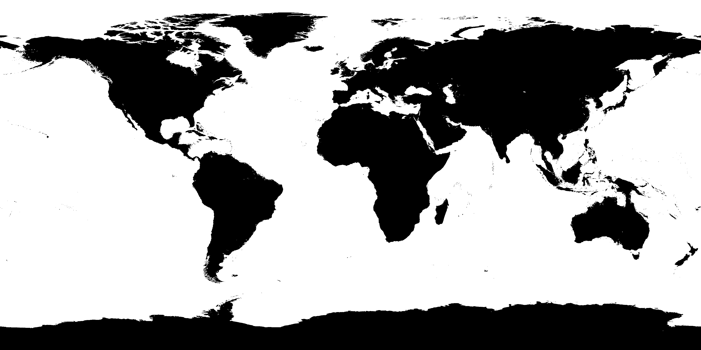

# rand-land-coords

Random latitude and longitude decimal coordinates.

## About

NASA bathymetry source image:

[](https://visibleearth.nasa.gov/view.php?id=73963)

Converted into bitmap-esque PNG:



Used to get random latitude/longitude decimal coordinate above land.

Inspired by this post: [HOW TO add random markers to a map BUT avoiding the sea?](https://stackoverflow.com/a/990177/922323)

## Usage

```js
const coords = require('rand-land-coords')({
  // Optional custom map location:
  map: 'image.png'
});

(async function start() {

  console.log('before');

  await coords().then((res) => {
    console.log(res); // { latitude: 32, longitude: 96.5 }
  }).catch((err) => {
    console.log(err);
  }).finally(() => {
    console.log('hello')
  });

  console.log('after');

})();
```

## License

Copyright © 2019 [Michael Hulse](http://mky.io).

Licensed under the Apache License, Version 2.0 (the “License”); you may not use this work except in compliance with the License. You may obtain a copy of the License in the LICENSE file, or at:

[http://www.apache.org/licenses/LICENSE-2.0](http://www.apache.org/licenses/LICENSE-2.0)

Unless required by applicable law or agreed to in writing, software distributed under the License is distributed on an “AS IS” BASIS, WITHOUT WARRANTIES OR CONDITIONS OF ANY KIND, either express or implied. See the License for the specific language governing permissions and limitations under the License.


